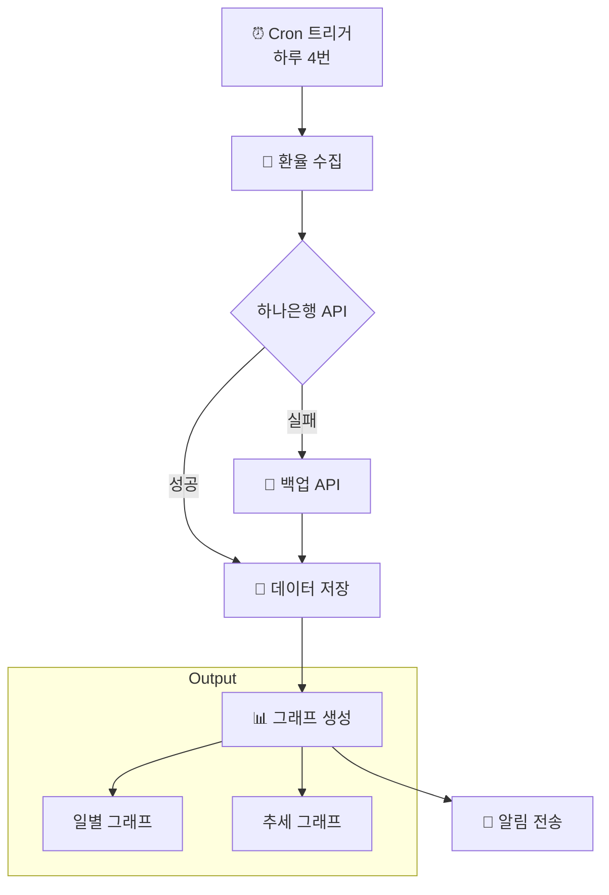

# Exchange Rate Tracker 📊💱

USD/KRW, USD/VND 환율을 추적하고 그래프로 시각화하는 OpenClaw 스킬

## 지원 통화

- 🇰🇷 **USD/KRW** (달러/원화)
- 🇻🇳 **USD/VND** (달러/베트남 동화)

## 기능

- 🔄 하루 4번 자동 환율 수집 (09:00, 12:00, 15:00, 18:00 GMT+7)
- 📊 일별/추세 그래프 자동 생성 (ASCII 아트)
- 💾 JSON 파일로 데이터 저장
- 📱 Slack/Telegram 알림 지원

## 동작 순서



## 그래프 출력

- **PNG 이미지:** `output/exchange_rate_YYYYMMDD.png`
- **데이터:** `references/exchange-rates.json`

**예시 출력:**
```
USD/KRW Exchange Rate (Last 7 Days)
━━━━━━━━━━━━━━━━━━━━━━━━━━━━━━━━━━
1500 ┤         ●───●
     │       ╱     ╲
1490 ┤     ●─●       ●─●
     │   ╱                 ╲
1480 ┤ ●─●                   ●─●
     └─────────────────────────
      3/1  3/2  3/3  3/4  3/5
```

## 사용법

```bash
# 스킬 설치
cp -r exchange-rate-tracker ~/.openclaw/skills/

# 수동 실행
python3 scripts/fetch_rate.py
python3 scripts/plot_graph.py
```

## Cron Job 설정

```json
{
  "name": "Exchange Rate Tracker",
  "schedule": {"kind": "cron", "expr": "0 2,5,8,11 * * *", "tz": "UTC"},
  "payload": {
    "kind": "agentTurn",
    "message": "exchange-rate-tracker 스킬로 환율을 수집하고 그래프를 생성해줘."
  }
}
```

## 파일 구조

```
exchange-rate-tracker/
├── SKILL.md
├── README.md
├── scripts/
│   ├── fetch_rate.py      # 환율 수집
│   └── plot_graph.py      # 그래프 생성
├── references/
│   ├── api-info.md        # API 정보
│   └── exchange-rates.json # 수집된 데이터 (git 제외)
└── output/                # 그래프 이미지 (git 제외)
```

## API 소스

1. **하나은행** (1차) - 웹 스크래핑
2. **ExchangeRate-API** (2차) - 무료 API

## 라이선스

MIT
